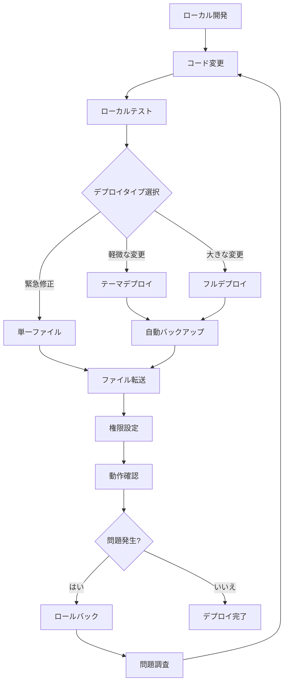
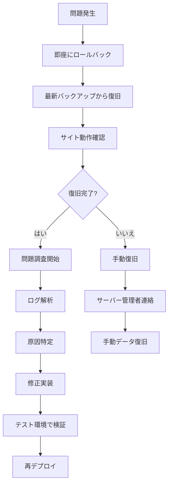

# 678 Studio デプロイ戦略

## 🎯 デプロイメント戦略

### 1. 段階的デプロイメント

#### Phase 1: 開発環境での検証
- **ローカル環境**: Docker環境での開発・テスト
- **品質チェック**: SCSS コンパイル、JavaScript動作確認
- **機能テスト**: WordPressテーマ機能の検証

#### Phase 2: ステージング環境（推奨）
- **ステージング**: 本番環境と同等の環境でのテスト
- **パフォーマンステスト**: サイト速度、レスポンス確認
- **SEO確認**: メタデータ、構造化データの検証

#### Phase 3: 本番環境デプロイ
- **バックアップ**: 自動バックアップ作成
- **デプロイ**: 段階的ファイル転送
- **検証**: サイト機能の確認

### 2. デプロイタイプ選択指針

#### 🚀 フルデプロイメント (deploy-full)
**使用場面:**
- 新機能の追加
- データベース構造の変更
- 大幅なテーマ更新
- 初回本番環境構築

**特徴:**
- 完全な環境同期
- データベース + ファイル
- 最も安全（自動バックアップ）
- 時間: 10-20分

#### ⚡ テーマデプロイ (deploy)
**使用場面:**
- CSS/SCSS の更新
- JavaScript の修正
- テンプレートファイルの変更
- 軽微な機能修正

**特徴:**
- テーマファイルのみ
- 高速デプロイ
- 自動ビルド付き
- 時間: 5-10分

#### 🎯 単一ファイルデプロイ (deploy-file)
**使用場面:**
- 緊急修正
- 設定ファイルの更新
- 特定のファイル修正
- ホットフィックス

**特徴:**
- 指定ファイルのみ
- 最速デプロイ
- 最小限の影響
- 時間: 1-2分

## 🔄 デプロイフロー

### 標準的なデプロイフロー

### 緊急時対応フロー

## 🛡️ セーフティネット

### 1. 自動バックアップシステム

#### バックアップタイミング
- **フルデプロイ前**: 必須
- **テーマデプロイ前**: 推奨
- **定期バックアップ**: 日次

#### バックアップ内容
- **データベース**: 完全ダンプ
- **ファイル**: WordPress ファイル一式
- **設定情報**: 環境設定ファイル

### 2. ロールバック機能

#### 自動ロールバック
- デプロイエラー時の自動復旧
- 設定可能なタイムアウト
- 段階的復旧プロセス

#### 手動ロールバック
- バックアップからの選択復旧
- 部分的ロールバック
- 検証付きロールバック

### 3. 検証システム

#### デプロイ前チェック
- ローカル環境の動作確認
- データベース接続検証
- SSH接続テスト
- 容量確認

#### デプロイ後チェック
- サイトアクセス確認
- 主要ページの動作確認
- エラーログ確認
- パフォーマンス確認

## 📊 リスク管理

### リスクレベル分類

#### 🔴 高リスク（フルデプロイ）
- **影響範囲**: サイト全体
- **復旧時間**: 10-30分
- **対策**: 必須バックアップ + 段階的デプロイ

#### 🟡 中リスク（テーマデプロイ）
- **影響範囲**: 見た目・機能
- **復旧時間**: 5-15分
- **対策**: 自動バックアップ + 検証

#### 🟢 低リスク（単一ファイル）
- **影響範囲**: 限定的
- **復旧時間**: 1-5分
- **対策**: ファイル履歴 + 即座復旧

### リスク軽減策

1. **段階的デプロイ**
   - 重要度順のファイル転送
   - 部分的動作確認
   - 問題発生時の即座停止

2. **並行バックアップ**
   - サーバー側バックアップ
   - ローカルバックアップ
   - 外部ストレージバックアップ

3. **監視システム**
   - リアルタイム監視
   - エラー通知
   - パフォーマンス監視

## 🔧 最適化戦略

### パフォーマンス最適化

#### ファイル転送最適化
- **差分転送**: rsync による効率的転送
- **圧縮転送**: gzip 圧縮での転送
- **並列処理**: 複数ファイルの同時転送

#### ビルド最適化
- **キャッシュ活用**: npm キャッシュの活用
- **並列ビルド**: SCSS + JS の並列処理
- **最適化ビルド**: 本番用最適化

### 運用最適化

#### 自動化レベル
- **Level 1**: 手動確認 + 自動デプロイ
- **Level 2**: 自動テスト + 自動デプロイ
- **Level 3**: 完全自動化（CI/CD）

#### 監視レベル
- **Basic**: エラーログ監視
- **Advanced**: パフォーマンス監視
- **Expert**: 予測的監視

## 📈 継続的改善

### メトリクス収集

#### デプロイメトリクス
- デプロイ実行回数
- 成功/失敗率
- 平均デプロイ時間
- ロールバック頻度

#### 品質メトリクス
- エラー発生率
- サイトダウンタイム
- パフォーマンス指標
- ユーザー影響

### 改善サイクル

1. **週次レビュー**: デプロイ実績の確認
2. **月次最適化**: プロセス改善の実装
3. **四半期評価**: 戦略の見直し
4. **年次更新**: システム全体の更新